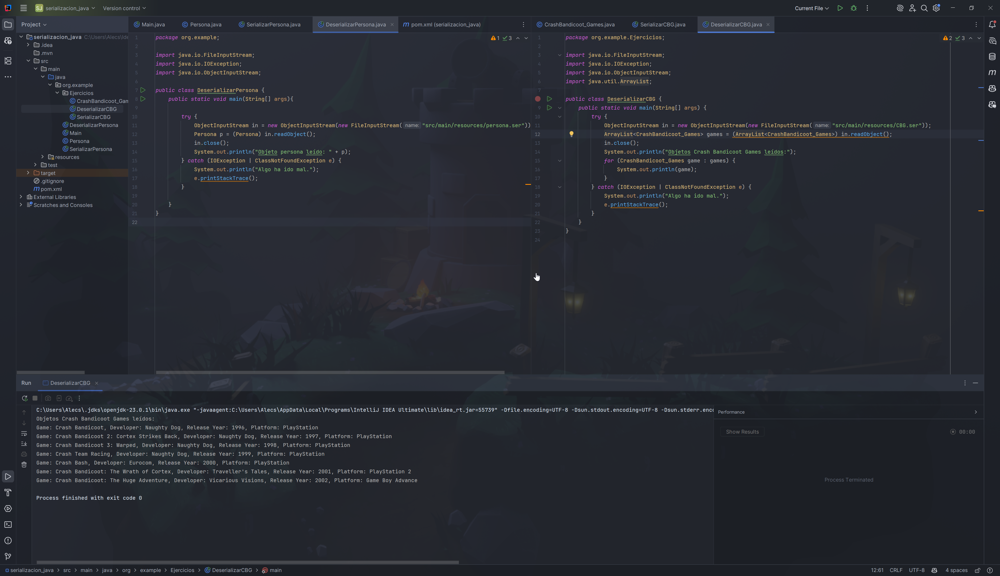
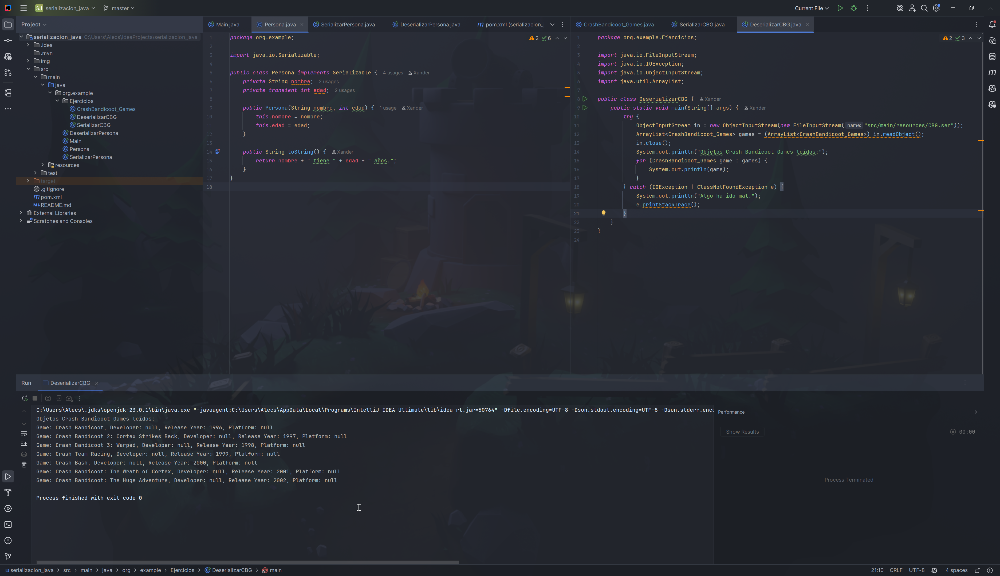
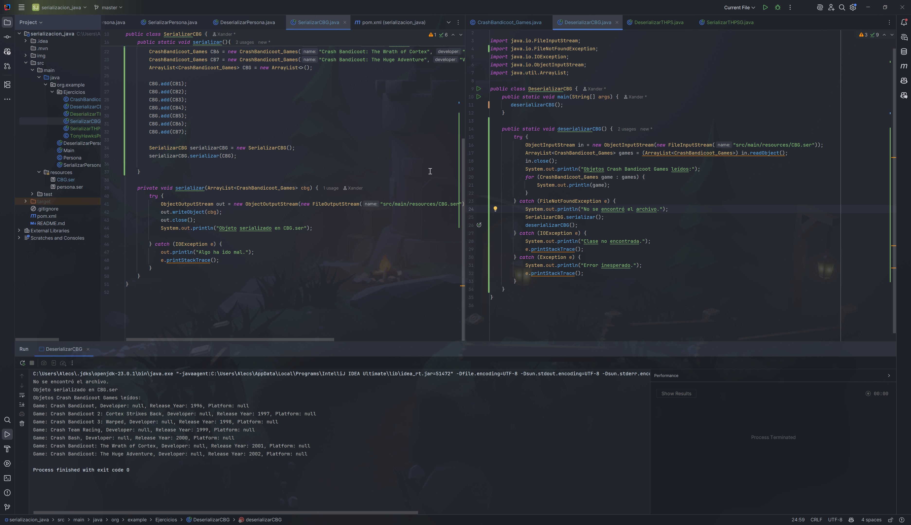
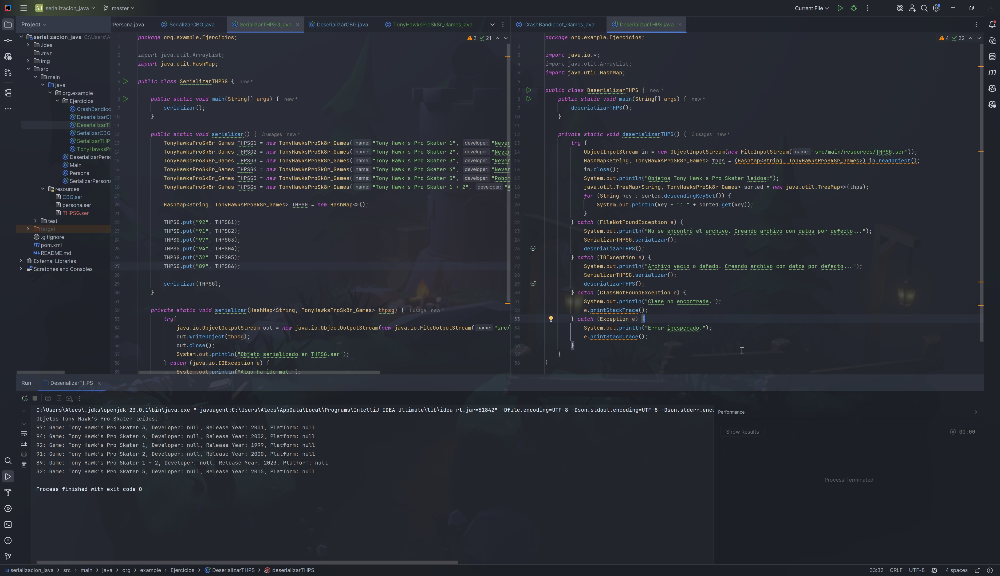
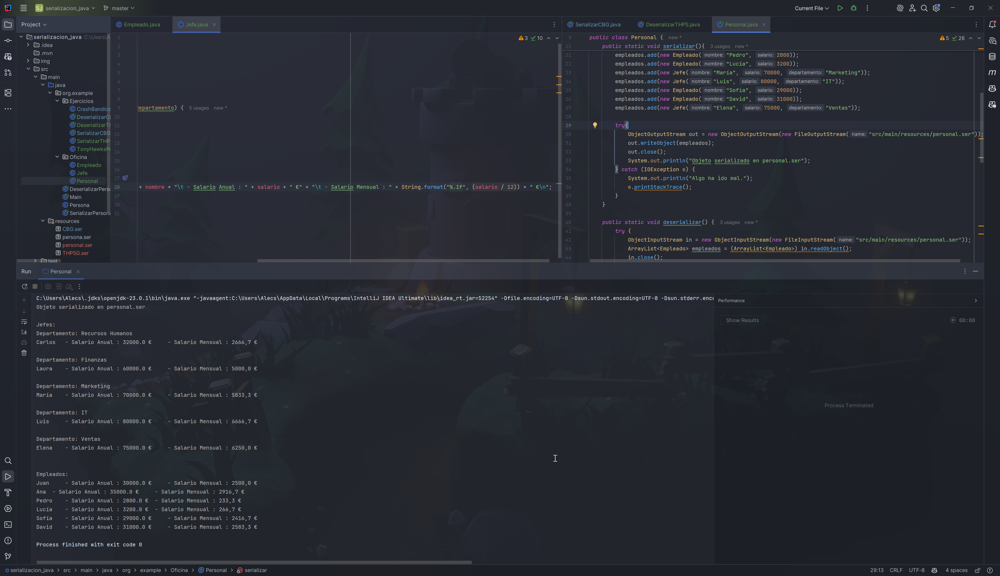

# Serialización de objetos

Serialización de objetos en Java

## Ejercicio 1

- Crea una clase nueva (con el nombre y atributos que quieras).

- Serializa una lista del tipo de la clase que hayas creado `ArrayList<TipoNuevo>` en el fichero **clase_prueba.ser** y luego recupérala (deserializa). 

- Al deserializar, recorre la lista y muestra todos sus elementos junto a los valores de cada atributo.

## Ejercicio 2

- Añade un atributo ***transient*** a tu clase (del tipo que quieras).

- Comprueba que el nuevo atributo no se serializa y que tiene valor ***null*** al recuperar al objeto.

## Ejercicio 3

- Maneja bien excepciones al deserializar un fichero que no existe o está dañado. Captura *FileNotFoundException y* *IOException.*

- Si falla, se debe crear el archivo 
  con datos por defecto. Usa el formato de la clase que te hayas creado 
  para los ejercicios anteriores.

## Ejercicio 4

- Serializa un `HashMap<String, TipoNuevo>` con varios objetos.

- Guárdalo en *mapa.ser*.

- Recupéralo y muéstralo ordenado por claves.

## Ejercicio 5

- Crea una jerarquía con clases ***Empleado*** y ***Jefe*** (que extiende de *Empleado* con los atributos ***nombre*** y ***salario***). La clase *Jefe* añadirá el atributo ***departamento***. <mark>Implementa *Serializable* sólo en la superclase</mark>.

- Serializa una lista que contenga empleados y jefes.

- Recupera la lista e imprime su contenido.

